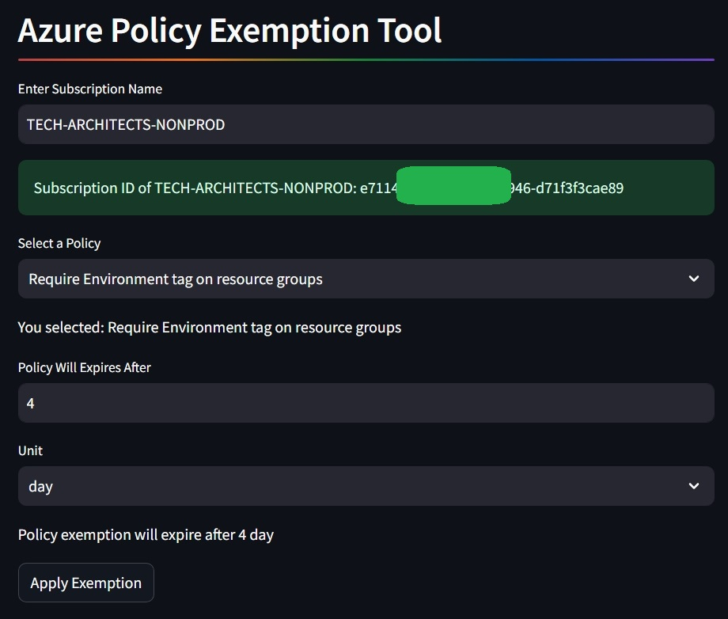

# azure-create-policy-exceptions
An automation to programmatically create policy exceptions in Azure Cloud

# Why Automation for Policy Exemptions is Essential

In modern cloud environments, policies play a crucial role in maintaining security, compliance,
and governance. However, there are instances where exceptions to these policies are necessary due to specific circumstances 
or operational needs. Automating the process of creating and managing policy exemptions offers several key benefits:

* Efficiency
* Consistency
* Scalability
* Auditability
* Reduced Administrative Overhead

# Overview of Policy Exemption Automation

Policy exemption automation simplifies the process of managing exceptions to cloud policies. 

>[!NOTE]
> Policy Exemptions are applied at Subscription level scope

Here’s a brief overview of how it works:

## Triggering Automation:

Automation can be triggered manually (e.g., via a request form) or automatically (e.g., based on specific conditions or events).

## Input Collection:

Gather necessary details such as policy name, exemption reason, scope (e.g., subscription or resource group), and expiration date.

## Validation:

Validate inputs to ensure they meet the criteria and constraints. checks of the entered policy assignmentexists on the scope provided.

## Create/Update Exemption:

Use Azure python SDKs to create or update the policy exemption based on the provided details.

# Inputs

| Input               | Description | Required |
|---------------------|-------------|----------|
| policy_name | Policy Name to be given Exception to | :heavy_check_mark: |
| subscription_name | From which subscription we need to provide exemption. the scope | :heavy_check_mark: |
| expires_after | Policy exemption should be automatically revoked after how long | :heavy_check_mark: |
| unit | How long . Possible values are `hour` , `day`, `month` | :heavy_check_mark: |

* The Expiration of Policy Exemption depends on 2 factors . expires_after value and the unit.

* Lets say the value of expires_after is `3` and unit is `day` - the expiration will be after `3 days` of executing the job 

* If value of expires_after is `2` and unit is `hour` - the expiration will be after `2 hours` of executing the job 

* If value of expires_after is `4` and unit is `month` - the expiration will be after `4 months` of executing the job 

# Streamlit UI

* Using streamlit to Create pythin application 



* Provide valid Subscription Name  

* This returns the Subscription Id corresponding to the Subscription name

* If entered Subscription Name is not found, None value is returned for Subscription Id 

* Once a valid subscription Id is returned using it, it will show us all assigned policies at the subscription level

* Select the policy from dropdown which needs exemption

* Provide a expires after value like 1 or 2 or 10 or 4.5 etc and unit value like day or month or hour.

* Click on Apply Exemption to apply exemption.

# Run code locally

* Clone the repository and change direcctory into this

* Install all dependancies using `poetry install`

* Execute `poetry run streamlit run .\streamlit_app.py`


# Azure Python SDKs used
use azure-identity for auth

* The Azure Identity library provides Microsoft Entra ID (formerly Azure Active Directory) token authentication support across the Azure SDK 
[azure-identity for auth](https://learn.microsoft.com/en-us/python/api/overview/azure/identity-readme?view=azure-python)

* We need the below Env variables present for the code to execute without any exceptions
[environmentcredential](https://learn.microsoft.com/en-us/python/api/azure-identity/azure.identity.environmentcredential?view=azure-python)

```markdown
Service principal with secret:

AZURE_TENANT_ID: ID of the service principal's tenant. Also called its 'directory' ID.

AZURE_CLIENT_ID: the service principal's client ID

AZURE_CLIENT_SECRET: one of the service principal's client secrets
```

* This is the Microsoft Azure Resource Management Client Library [azure-mgmt-resource-policy](https://learn.microsoft.com/en-us/python/api/azure-mgmt-resource/azure.mgmt.resource.policy.v2022_06_01.operations.policyassignmentsoperations?view=azure-python#azure-mgmt-resource-policy-v2022-06-01-operations-policyassignmentsoperations-list)

* This is Microsoft python SDK for executing resource graph query [azure.mgmt.resourcegraph](https://learn.microsoft.com/en-us/python/api/azure-mgmt-resourcegraph/azure.mgmt.resourcegraph.resourcegraphclient?view=azure-python)

* This package is used to throw detailed exceptions of exceptions [azure.core.exceptions](https://learn.microsoft.com/en-us/python/api/azure-core/azure.core.exceptions?view=azure-python)

>[!TIP]
> The policy exemption name length must not exceed '64' characters. I am using the same as policy name for exception.
> You can choose to change it as you see fit 

